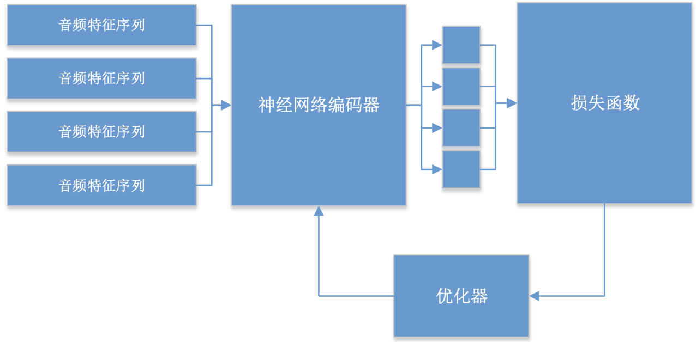
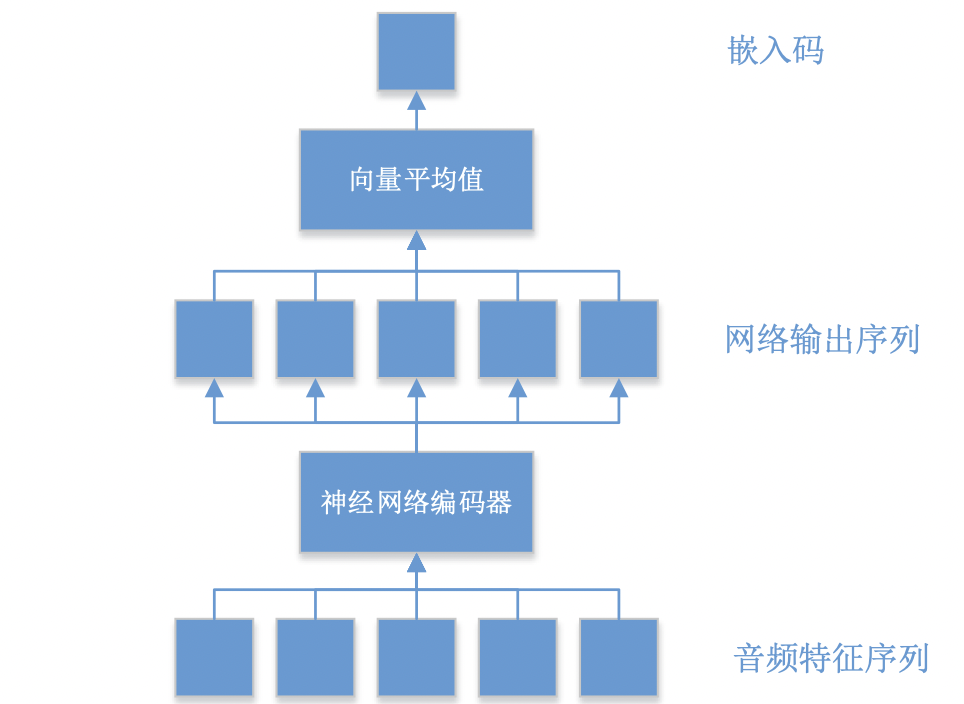
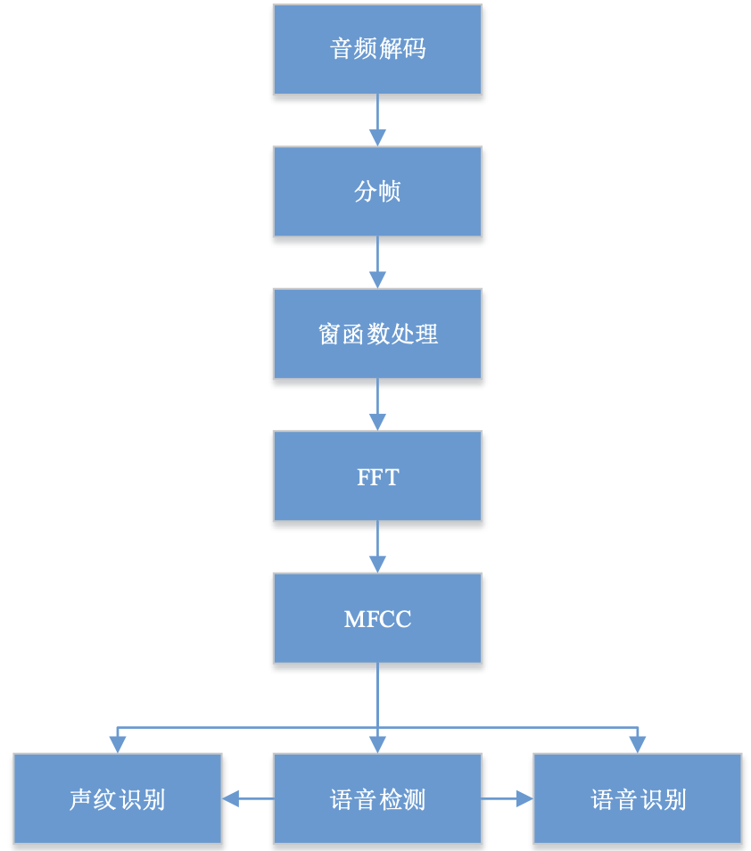

# 声纹识别单元设计-开题原理篇

## 一、**课题来源及研究的目的和意义**

声纹是语音中所蕴涵的、能表征和标识**说话人**的语音特征，以及基于这些特征(参数)所建立的语音模型的总称。声纹作为生物特征，在身份认证的应用中具有不会丢失、被盗或遗忘的特性。声纹识别技术是当下最热门的技术之一，在远程认证等应用领域具有独特优势。与其他生物特征相比，作为行为特征的声纹具有以下特点：

- 蕴含声纹特征的语音获取方便，在采集过程中涉及到的用户个人隐私信息较少。因此使用者更易接受；
- 语音采集装置成本低廉，使用简单，一个麦克风即可；
- 配合语音识别技术，可以使声纹口令动态变化而无需担心密码遗忘、丢失和窃取的问题，防止录音假冒，也适合远程身份认证。

声纹识别是根据待识别语音的声纹特征识别该段语音所对应的说话人的过程。与指纹类似，每个人在说话过程中所蕴涵的语音特征和发音习惯几乎是独一无二的。声纹识别和语音识别看似相同实则不同。声纹识别的过程是试图找到区别每个人的个性特征，而语音识别则是侧重于对话者所表述的内容进行区分。在实际应用中往往把语音识别技术和声纹识别技术结合起来使用，可以进一步提高声纹身份认证系统的安全性能。

总体来说，声纹识别是一类典型的模式识别问题，其主要包含说话人模型训练和测试语音识别2个阶段。

1. **训练阶段**
    
    对使用系统的说话人预留充足的语音，并对不同说话人语音提取声学特征，然后根据每个说话人的语音特征训练得到对应的说话人模型，最终将全体说话人模型集合在一起组成系统的说话人模型库。
    
2. **识别阶段**
    
    进行识别认证时，系统对识别语音进行相同的特征提取过程，并将语音特征与说话人模型库进行比对，得到对应说话人模型的相似性打分，最终根据识别打分判别得到识别语音的说话人身份。
    

在实际应用中，声纹识别单元一般部署在靠近数据输入或用户的地方提供运算、识别的服务。STM32是常用的微处理器，适合边缘部署；而FPGA同样作为边缘计算部署平台，具有丰富的运算资源，可以极大简化并对深度学习进行加速。

## 二、**国内外在该方向的研究现状及分析**

2011年，苹果公司最新的智能手机iPhone 4S首次搭载了智能语音助手Siri；2014年，美国亚马逊公司开发的智能音箱Echo横空出世。此后，2015年京东与科大讯飞合作开发了智能音箱叮咚；2016年谷歌发布搭载了谷歌助手Google Assistant的智能音箱Google Home；2017年苹果推出自家的智能音箱HomePod；同年，阿里巴巴人工智能实验室发布智能音箱天猫精灵，小米发布小米AI音箱，百度发布智能音箱Raven H，喜马拉雅发布小雅AI音箱。这些商业产品的背后，都凝聚着音频处理、语音识别和自然语言处理等多个领域数十年的研究成果。但很可惜，上述产品在最初发布的时候都没有加入任何声纹识别方面的技术，这就导致智能语音助手无法根据说话人的身份，提供个性化的回答，并决定是否提供较为隐私的用户信息。

而谷歌公司在声纹领域的领军地位，除了其率先发表的关于d-vector技术的多篇论文外，更在于其首次将声纹技术部署到了其诸多产品之中。谷歌推出语音搜索后不久，便将唤醒词 "OK Google"部署到了安卓手机操作系统上，使得用户能够选择通过唤醒词的声纹来解锁手机。2017年，谷歌率先将基于唤醒词的文本相关的声纹识别技术部署到了智能音箱Google Home使得用户能够与智能语音助手进行个性化的语音交互，2018年，谷歌又将文本无关的声纹识别技术部署到了GoogleHome上，用于进一步扩充应用场景，以及提升声纹识别的准确率。2020年，谷歌将声纹识别技术部署到了包括Sonos和Bose在内的所有支持谷歌语音助手的第三方设备上，使得更多用户能够体验声纹识别带来的个性化交互体验。

以苹果Siri为例。

(以下图源：[https://machinelearning.apple.com/research/hey-siri](https://machinelearning.apple.com/research/hey-siri))

苹果的Siri允许用户免提的调用Siri，这个过程是硬件、软件和互联网无缝的协同工作。当用户在忙碌的时候可以通过Hey Siri~来唤醒，Siri大部分实现是在云端，包括主要的自动语音识别、自然语言处理和声学模型的更新等信息服务。

iPhone的麦克风是以每秒16000转的速度将语音转换为瞬时波形流，在频谱分析的时候会将其转换为一系列的帧，每个帧大概描述约0.01秒的声音频谱，一次约20左右的帧被输入声学模型(深度神经网络DNN)，描述一个语音的概率分布。所有计算都在模型中完成，当满足阈值条件后就会激活Siri。(阈值是动态的，以便在困难的条件下更轻松的激活Siri)。

上述功能的实现，就注定了传感器不仅要准确，而且要快速，对电池续航时间没有显著影响，而且还要最大限度的减少内存使用和处理器的需求。iPhone始终在一个低功率的辅助处理器来访问麦克风信号，并用这些有限的处理能力来运行声学模型。所以要充分考虑硬件之间，以及硬件和软件之间的协同工作。

## 三**、主要研究内容**

按照研究内容，该课题可以分为两个部分：**声纹识别算法设计**以及**声纹识别的工程部署**。

### 3.1 声纹识别算法设计

声纹识别算法的流程包含两个阶段：声纹录入阶段和实际运行的识别阶段。

**3.1.1 声纹录入**

声纹录入阶段的流程图如下图所示：

在声纹录入阶段，目标说话人一般都要提供多段语音，若是文本无关的声纹识别，会额外要求这些语音对应的文本互不相同，以覆盖更多的音节、字词。每一段语音会进行分帧、加窗并提取特征(在必要的时候考虑进行帧叠加)，然后进行声纹建模。对目标说话人提供的每一段录入音频进行声纹建模后，还会额外对这些模型进行聚合，从而得到一个单一的说话人模型，用来表征声纹特征。

录入阶段过程中最为关键的部分就是声纹建模单元，它的任务就是对一段语音所对应的音频特征序列进行变换，从而能得到能够更好地表征其说话人声纹特征的模型。该模块目前业界主流都是采用基于深度学习的方法，现在随着各种神经网络库的成熟与普及，神经网络技术无论是在代码实现，还是在产品、服务中的部署，都比深度学习之前的方法要容易得多。深度学习有几个基础的网络结构，分别是**前馈神经网络**、**卷积神经网络**和**循环神经网络**等。目前大部分直接用于声纹识别的神经网络都可以用下面的通用架构进行概括。

左侧为长度不一的各个音频特征序列，这些序列可以来自不同的说话人。每一段音频特征序列经过神经网络后，得到一个固定长度的嵌入码。这一过程中的难点在于，音频本身的长度是不确定的。给定一段不定长度的音频特征序列，通过神经网络将其转换为一个固定维度的嵌入码，这个过程便是神经网络运行时的推理逻辑。当我们将神经网络部署到产品中，无论产品中的神经网络是在服务器端运行还是在设备端运行，在运行过程中，**通常都不需要更新产品中的神经网络的参数，而是直接调用神经网络的推理逻辑来处理输入信号**。

**3.1.2 声纹识别**

声纹识别的流程图如下图所示：

在识别阶段，待验证的音频需要通过与录入阶段完全相同的特征提取及声纹建模过程，得到其声纹模型。然后，需要将该验证音频的声纹模型与所有目标说话人的说话人模型进行相似匹配，根据匹配结果进行判别，并得到最终的识别结果。一般的相似匹配采取的方法是利用余弦相似度、欧氏距离计算两个嵌入码之间的相似度，然后和设定的阈值比较大小，做出最终判别。

### 3.2 声纹识别的工程部署

模型不等于产品。训练数据，利用特定算法训练出一组声纹识别模型，并在测试数据上验证其性能，这些工作加在一起，足以构成一个完整的研究项目。不过，在拥有一个性能不错的声纹识别模型仅仅是万里长征的第一步。要将声纹模型部署到产品中，还有着无数的工程问题需要解决，例如系统的架构、模型的发布、软件的维护，以及用户与产品之间的交互等等。不过这个项目规模较小，不会存在软件管理上的问题。不过一些隐形的工程问题还是存在的。

**3.2.1 适配硬件的语音处理引擎**

无论是信号处理还是机器学习领域，都有大量以Python语言编写的库。这些库方便安装，容易使用。不过在部署上往往不会使用这些。学术上利用各种Python的库来搭建网络，但Python具有效率低下，环境局限等特点，所以在确定了硬件后，采用C/C++编写引擎可以针对具体硬件进行优化，将运行效率提升至极致。不过信号处理的分帧、窗函数处理、傅里叶变换等都通过专用引擎来实现，机器学习部分就必须通过调用该引擎来提取特征。即使第三方的Python库可以提取类似的特征，并且将Python库的参数设置为与专用引擎完全一致，也很难保证两者的实现完全一致。尤其对于较长的时间序列而言，实现方式非常细微的差别都可能导致最终信号处理结果的迥然相异。

**3.2.2** **声纹录入阶段的工程问题**

录入阶段面临三个问题：

1. 什么时候开始录音？
2. 什么时候结束录音？
3. 如何验证录音是否成功？

对于前两个问题，主要有两种解决方法。如果对应的文本是唤醒词，那么只要在录入的过程中同时运行唤醒词检测算法即可。如果需要N段录入音频，那么当唤醒词检测算法检测N次唤醒词之后，就结束录音。对于验证录音是否成功，如果文本为唤醒词，通常不存在这个问题，因为如果唤醒词被检测到，就意味着文本肯定是正确的。对于不是唤醒词的文本，理想情况下，我们希望额外对每一次录入得到的音频单独运行语音识别，来判断对应的文本是否正确。但语音识别非常耗费CPU资源，所以一个比较常见的做法是专门训练一个简单的小型模型，用以替代完整的语音识别模型。该小型模型只需要判断一段音频是否对应着一段特定的文字，相当于一个二值判别分类器。

**3.2.3 声纹识别阶段的工程问题**

对于文本相关的声纹识别，很多情况下声纹识别需要和唤醒词检测协同运作。在这种情况下，一般在唤醒词被触发之后，由唤醒词检测算法将唤醒词对应的音频片段传入声纹识别算法。这就要求唤醒词检测系统在设汁的时候注意两点：

- 唤醒词检测算法需要将处理过的音频缓存起来，并且该缓存区的大小不能小于声纹识别系统所要求的音频长度。
- 唤醒词检测算法得要能够提供唤醒词对应的起点与终点。

也就是说，唤醒词检测算法需要以被检测到的唤醒词的起点与终点为边界，从缓存区的音频中，截取出声纹识别系统所需要的输入信号。当声纹识别系统运行完成之后，其运行结果将会与唤醒词检测的结果共同作为判定依据，从而提升整个系统的综合性能。除此之外，无论是文本相关还是文本无关，声纹识别经常需要与语音识别协同运作。声纹识别与语音识别的协同运作主要有两种形式：语音识别系统对声纹识别结果的依赖以及语音识别与声纹识别的竞争冒险。

**3.2.4** **边缘端部署面临的资源挑战**

一般来说，产品部署的方式有三类：全设备端部署、全服务器端部署，以及复合式部署。本课题的初步目标就是全设备部署。这样无论是架构，还是版本迭代更新策略都非常简单，但是这种部署方式有一个巨大的挑战，那就是设备端有限的资源。包括CPU、内存、硬盘、电池等。

## 四、研究方案

系统架构图如下图所示：

从音频信号到特征帧的处理流程：

### 4.1 音频信号的预处理与数据集的制作

无论部署的模型多么先进，算法多么精妙，在离不开与声音打交道。只有接上了正确的音频信号.并从其中提取出了有意义的特征表示，后面的模型才能最大程度地发挥其作用。要开发一个好的声纹模型，使用好的数据进行训练格外重要。具体到声纹识别的问题，声纹识别所需要的数据比较简单， 每一则数据只需要以下信息：

1. 一段只包含单一说话人语音的音频。
2. 用于表示该音频所包含的说话人身份的独特标签。

所以针对以上需求，我们从音频模拟信号开始，循序渐进的讨论。

**4.1.1 人耳特征**

人耳对声音的感知是非线性的，这是由人耳的生理构造决定的。这种非线性主要体现在两方面：对频率感知的非线性，以及对声强感知的非线性。一个好的音频信号处理系统，需要考虑这两方面的因素。为了描述人耳对于频率感知的非线性，学术界提出巴克刻度、梅尔刻度和ERB刻度等。同时人耳对声强的感知也是非线性的。一般来说，人耳对于高振幅信号的差距，不如对低振幅信号的差距那么敏感。因此，在许多音频信号处理系统中，都会对信号的振幅应用一个非线性函数来模拟人耳的这一特性。最常用的两个非线性函数，分别是对数函数与幂函数。例如在梅尔倒谱系数特征中，采用对数函数；而感知线性编码特征则采用立方根函数。

**4.1.2 采样与量化**

计算机所处理、存储的音频信号通常都是数字信号，将连续的模拟信号转换为离散的数字信号有两个步骤：采祥和量化。通过采样与量化，我们能够将连续的音频信号表示为一个离散的整数序列。但计算机存储音频文件，以及在网络间进行传输时，所使用的是二进制的字节序列表示。为了更有效率地表示音频信号，我们需要对音频信号进行编码处理。相应地，将二进制字节恢复成音频信号的过程称为解码。鉴于人耳的听觉具有非线性，我们在量化的时候，可以对低振幅的信号采用较高的精度，而对高振幅的信号采用较低的精度。这种编码通常称为非线性脉冲编码。除此方法外还有很多优秀的编码方法。最后我们会得到一段音频信号。

**4.1.3 短时分析技术、分帧与加窗**

对于一整段音频信号，其长度通常不是固定的，可以短至几百毫秒，或者长达数十分钟。如何从不定长度的音频信号中提取出固定长度的特征向量呢？

传统的特征分析方法，是将整段音频当成一个整体，然后提取其中的一些统计量。例如，一个简单的做法是将整段信号进行傅里叶变换，得到信号的频谱。该频谱具备固定的维度，因此可以作为这段音频的一个特征。此外，可以估算整段音频的基频、共振峰等特性，将其作为该音频的特征的一部分。这种基于整段音频信号的全局特征有着显而易见的缺点。音频信号是随着时间的变化而变化的，在人们说话的时候，每发出一个音节，其对应的音频特征都会与这段音频的其他部分截然不同。**传统的全局特征分析方法，相当于对音频信号在时间轴上做了某种平滑处理，从而使时间分辨率降为零。这种做法会丢失信号中的大量局部信息。 如果音频中有一些噪音片段，那么这些片段会对最后得到的特征造成进一步污染。**

由此可见，全局特征只有当信号十分平稳的时候才是有意义的。例如信号本身是周期信号，其局部特征不随时间变化而变化，那么其全局特征便等价于其局部特征。然而，对于大多数音频信号，尤其是语音信号来说，信号本身是不平稳的。因此，需要从局部提取特征，因为在每一个局部的短时间内，可以近似地认为信号是平稳的。这一点，便是音频信号特征分析的基础：短时分析技术。

在观看视频的时候，我们看到的其实是一帧一帧的图像。这些图像帧按照特定的频率播放，从而让人产生视觉上的连续性。而对于语音信号，我们一样可以将采样信号在时间轴上分割为很多短小的片段，这些片段称为帧。在分帧过程中，最重要的两个参数便是帧本身的长度，以及帧与帧之间的间隔。通常，我们可以假定语音信号在10毫秒的范围内是较为平稳的，因此可以将帧的长度设置在这个范围内。一组在业界比较常见的分帧设置，是采用25毫秒的帧长度，以及10毫秒的帧间隔。在这个设定下，假如音频采样率为16000Hz，我们对每一帧提取40维的特征。那么考虑一段长度为一秒的音频，其本身有16000个采样点，而经过分帧之后再提取特征，将得到100×40=4000个特征，需要处理的数据量减少了75%。分帧通常是所有短时分析技术的第一步。不同的音频信号，其采样率可能会不同，但是在经过分帧之后，所得到的帧的频率却是固定的。这对于需要处理来自不同设备、包含不同采样率的信号的语音识别或声纹识别系统来说极为重要。

在对采样信号进行分帧处理之后，便可以对每一帧信号进行特征提取。为了避免吉布斯现象和频谱泄漏所带来的负面影响，可以对分帧之后的信号迸行加窗处理，就是将一帧信号的每个值乘以不同的权重。而不同的窗函数，对应着不同的权重设计思路。窗函数的设计重点在于，通过将较大的权重赋予靠近窗中心的信号，将接近零的权重赋予靠近窗边缘的信号，减轻分帧时造成的信号不连续性。满足上述条件的最简单的窗函数，便是高斯函数。

**4.1.4 特征提取、帧叠加与帧采样**

通过对数字信号进行分帧、加窗处理，我们得到固定时间间隔的音频帧。从这些音频帧中提取出固定维度的特征向量，再对这些特征进行帧叠加与帧采样，从而得到最终的特征帧。这些最终的特征帧将被作为机器学习算法的输入，去完成语音检测、语音识别及声纹识别等高级任务。

音频信号的特征一般分为时域特征与频域特征两大类。前者直接对以时间为自变量的采样信号进行特征提取；后者先通过傅里叶分析将信号转换到频域，再进行特征提取。目前大部分实用系统都采用频域特征。我们通常使用离散傅里叶变换计算频域特征，频谱幅值特征算是最简单的频域特征，已经能够直接作为机器学习系统的输入，去实现语音识别等高级任务。但实际上，业界很少直接利用频谱幅值建模，而是会对频谱进行进一步的处理，比如功率正则化倒谱系数等音频特征。

在进行特征提取之后，理论上这些特征可以直接用于语音检测、语音识别、声纹识别等不同的音频处理系统。不过有时我们会发现，不同的系统所采用的模型对特征的上下文的要求会不太一样。对于语音识别系统来说，我们将每一帧的信息单独输入模型，可能效果不如每次将连续的4帧特征同时输入模型。这是因为，连续多帧的特征组合在一起后，能够对单帧周围的上下文信息有一个更好的描述，可以更好地覆盖完整的音节。但是对于其他系统，同样的配置却未必是最优的。将相邻帧的特征拼接起来合成一个新的帧的做法，称为帧叠加。不过需要注意在帧叠加的过程中，初始和结尾的若干帧由于没有足够的相邻帧与其拼接，需要进行一些特殊处理。此外，将连续的多帧信息作为模型输入时，帧的维度会增加数倍，因此模型的参数显然会大量增加。为了不使计算开销过大，在运行模型的时候，可以有规律地跳过一些帧来减小计算量，这种做法常被称为帧采样。

通过以上的技术手段，我们可以完成数据集的采集与制作。想进一步增加数据的多样性，可以通过数据增强等方式。

### **4.2 声纹录入和声纹识别**

决定声纹识别性能的有两个方面，其一是推理逻辑，其二就是模型训练。模型训练中还包括数据的预处理方法、损失函数的设计和优化器的选取等多方面因素。

**4.2.1 声纹建模的推理逻辑**

在各种推理逻辑中，最简单、直观的便是将特征序列中的每一帧看作一组独立的特征作为神经网络的输入，然后得到该帧的输出。这种做法通常称为逐帧推理。在逐帧推理方法中，由于每一帧的输入和输出都是互相独立的，神经网络不需要拥有任何记忆，用简单的前馈神经网络便可。如果每一帧涵盖的时间范围较短，特征较少，导致神经网络输入的信息量不足，则可以考虑使用帧叠加与帧采样方法，使每一帧的特征包含尽可能多的上下文信息。

不过，逐帧推理网络的缺点也是显而易见的。即便采用了帧叠加与帧采样的方法，一帧音频特征所涵盖的音频内容也不过数十毫秒。

对于文本相关的声纹识别，尤其是基于特定唤醒词的声纹识别，通常可以假定该文本对应的音频长度固定在某个较稳定的范围内。如果唤醒词检测算法在检测唤醒词的同时给定了唤醒词的边界，则可通过该边界提取固定长度的窗口，从而完成固定窗推理。固定窗推理方法较早也较具代表性的工作，是谷歌于2014年发表的一篇论文。论文中的声纹识别系统被用于识别谷歌的唤醒词“OK Google”所对应的说话人。唤醒词检测算法持续在长度为800毫秒的窗口上运行，一旦唤醒词被检测到，声纹识别网络便会触发，并在对应的800毫秒窗口上运行。基于固定窗推理的神经网络，输入的维度是固定的，因此同样可以采用基于批的训练。这种网络一般不会采用循环神经网络，而是使用前馈或卷积网络实现。其最致命的缺点，便是无法被应用于输入长度可变的文本无关声纹识别。

逐帧推理的神经网络可以处理任意长度的音频特征序列，固定窗推理的神经网络可以有效利用每一帧的上下文信息，那么将两者的优势结合起来就是基于全序列推理的神经网络。全序列推理的方法需要借助循环神经网络来实现。在我们输入音频特征序列之前，循环神经网络会重置其状态为初始状态。我们将音频特征序列中的特征帧按时间顺序依次作为输入，每当循环神经网络处理完一帧输入之后，其状态便会更新，并影响到之后的输出。因为循环神经网络在音频特征序列的每一帧都有输出，因此输出序列也是不定长度的。为了将不定长度的输出序列转换为固定长度的嵌入码，一般有两种设计方法：一种是基于池化的全序列推理；另一种是基于末帧的全序列推理。

尽管全序列推理神经网络有着诸多优点，但其也有一个致命的缺点：其无法简单地通过批处理实现高效的大规模训练。批处理通常要求同一批输入数据的维度是一致的，只有这样才能通过张量运算计算整批输入数据的损失函数与梯度，从而进行优化。而在全序列推理神经网络的训练过程中，通常每一个输入序列的长度都是不一样的，因此其批的大小只能被设定为1。这一缺点在小规模数据集上可能并不明显，一旦需要在包含数十万说话人的数据集上进行训练，便会发现全序列推理神经网络的收敛速度极慢。

谷歌对之前几种推理方法取长补短，于2018年做出了滑动窗推理方法的尝试。此处不再过多赘述。

在进行推理逻辑后，我们得到一组嵌入码，根据这些嵌入码及每段音频特征序列所对应的真实说话人，可以计算出某个用以衡量嵌入码性能的损失函数。在训练过程中，我们可以用随机梯度下降或Adam等算法对损失函数进行优化，从而更新神经网络编码器的参数，直至其收敛为止。

**4.2.2  损失函数**

在确定合适的推理逻辑的同时，我们也需要考虑如何设计最适用于声纹识别问题的损失函数。如果我们考虑由M个说话人组成的闭集内的声纹辨认问题，那么该问题可以近似地看作一个M元的分类问题。对于用于多元分类的神经网络，机器学习领域已经存在一些非常成熟的标准做法，其中最常用的便是交叉熵损失函数。若要使用交叉熵损失函数，神经网络的最后一层需要采用M元的归一化指数函数，该函数能将任意实数值的向量转换为相同维度的概率分布。一旦有了概率分布，我们希望其能够尽可能地接近真实概率。交叉熵就是用来描述两个概率分布的相似程度的函数。

尽管交叉熵损失函数在分类问题上效果极佳，不过具体到声纹识别领域，却出现了一个问题，那就是限定在某个闭集内的声纹辨认其实并不太实用。更多时候，我们希望将通过交叉熵损失函数训练得到的神经网络，应用于闭集之外的说话人的声纹验证。因此，交叉熵损失函数一般只在早期的工作中比较常见，较为先进的声纹识别系统一般不会采用这种训练方式。

我们要是想直接对嵌入码进行优化，则需要明确目标是什么：

1. 对于同一个说话人，其每一段音频通过神经网络编码器得到的嵌入码，互相之间应该尽可能相似。
2. 对于两个不同的说话人，他(她)们的音频通过神经网络编码器得到的嵌入码，互相之间应该尽可能相异。

三元损失函数便是基于这种思路设计出的一种损失函数。在这之后，Google针对不同的场景、架构下进行优化的目的，又提出广义端到端损失函数等。

### 4.3 工程部署

**4.3.1 STM32的深度学习应用**

STM32推出了Cube.AI人工智能神经网络开发工具包，目标是将AI引入微控制器供电的智能设备，位于节点边缘，以及物联网，智能建筑，工业和医疗应用中的深度嵌入式设备。

Cube.AI的主要特点：

1. 从预先训练的神经网络模型生成STM32优化的库。
2. 支持各种深度学习框架，如Keras，Caffe，ConvnetJS和Lasagne。
3. 通过STM32Cube集成，可轻松实现不同STM32微控制器系列的便携性。

**4.3.2 语音处理引擎**

课题优先选取C/C++的机器学习库。另外在语音处理引擎实现的时候，为了保证代码的可复用性和系统的可扩展性，在这里将采用计算图的设计模式，搭配计算图描述语言实现逻辑与配置之间更好的分离。一个简单的计算图实例如下图所示：

箭头所指即为数据流向，运行时，数据是从后级模块向前级模块拉取。首先音频解码模块从数据缓冲区内读取音频信号，之后分帧，加窗，做FFT后获得一帧MFCC特征。由于部分模块具有多个前级模块，如声纹识别单元需要来自MFCC模块的音频特征，也需要来自语音检测模块的结果。所以这就需要前级模块自带时间戳标记，当前已有结果的时间标记决定了下次从上级模块中拉取的结果。多个后级模块也亦然。

**4.3.3 降低开销的一些可行的尝试**

1. 编译并构建语音处理引擎的时候，尽量减少对其他库的依赖，以保证部署到设备端的引擎库占用最小的硬盘资源。
2. 语音处理引擎可以针对具体硬件进行相应的优化，例如如果设备端有DSP芯片，那么语音处理引擎便可以在该芯片上运行一部分模型，从而降低CPU的负担。
3. 在架构上，声纹识别模型应尽量减少使用卷积神经网络等计算量庞大的运算，节省CPU开销。
4. 可利用帧叠加与帧采样技术，对输入帧进行降采样作为声纹识别模型的输入，从而降低声纹识别模型的运行次数，节省CPU的开销。
5. 利用模型压缩或模型稀疏化等技术，减少模型参数，从而降低CPU、内存和硬盘等开销。
6. 利用模型量化技术，将模型中的浮点实数以单字节整数格式存储，从而降低模型占用的硬盘与内存空间、并充分利用硬件所支持的整数运算指令集提升运算速度。

### 4.4 技术指标

为检测声纹识别系统的准确性与稳定性，在构造数据集之后，将数据集分割为录入集与验证集。

举一个简单的例子，假如测试集用了来自1号说话人的3段语音{U_11,U_12,U_13}，以及来自2号说话人的3段语音{U_21,U_22,U_23}，那么一个可行的分割方案为：每个说话人取两段话音作为录入集{U_11,U_12,U_21,U_22}，其余语音作为验证集{U_13,U_23}。

完成测试集的分割之后，通常先利用录入集中的语音对每一个说话人进行声纹录入，最终得到一个包含了所有说话人声纹模型的模型库。之后便可以将验证集中的语音与模型库中的说话人模型进行相似匹配，并根据该模型是否来自真实说话人计算评价指标。指标有ROC曲线、等错率、辨认准确率等等。本课题初步达到的目标是准确率达到80%以上。

## 五、进度安排，预期达到的目标

2022年1月1日到2月20日 确定硬件(STM32及FPGA)方案，构建语音处理引擎，在PC平台上编写深度学习算法。

2022年2月23日到4月1日  部署算法，结合声音数据集进行实验，评估算法的有效性及硬件整体性能。

2022年4月11日到6月3日  整理各种文档，撰写毕业论文。

## 六、研究过程中可能遇到的困难和问题，解决的措施

### 7.1 音频处理环节

我们分好帧后，将每一帧单独输入模型，可能效果不如每次将连续的4帧特征同时输入模型。这是因为，连续多帧的特征组合在一起后，能够对单帧周围的上下文信息有一个更好的描述，可以更好地覆盖完整的音节。但是对于其他系统，同样的配置却未必是最优的。所以我们在实际操作时可以将相邻帧的特征拼接起来合成一个新的帧。不过需要注意在帧叠加的过程中，初始和结尾的若干帧由于没有足够的相邻帧与其拼接，需要进行一些特殊处理。类比图像处理中的边缘处理一样。此外，将连续的多帧信息作为模型输入时，帧的维度会增加数倍，因此模型的参数显然会大量增加。为了不使计算开销过大，在运行模型的时候，可以有规律地跳过一些帧来减小计算量。

### 7.2 声纹建模的算法细节

关于推理逻辑和损失函数的设计，可以参考谷歌的工作。

### 7.3 降低算法开销

本课题的重点和难点之一就是在模型的部署上。由于STM32算力有限，所以我们必须对深度学习生成的模型进行处理才可以。文中提出模型量化、剪枝等方法，需要我们探索可行性。

##