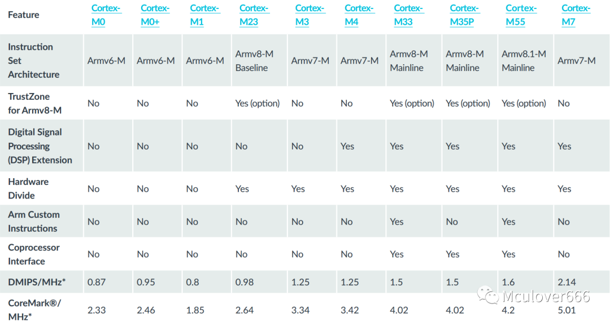
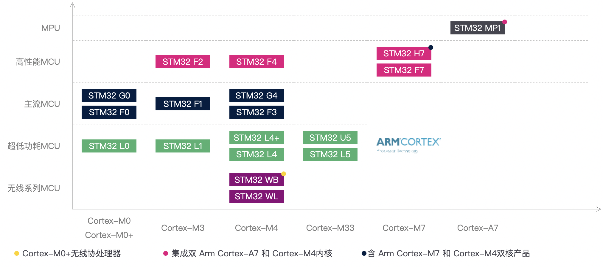
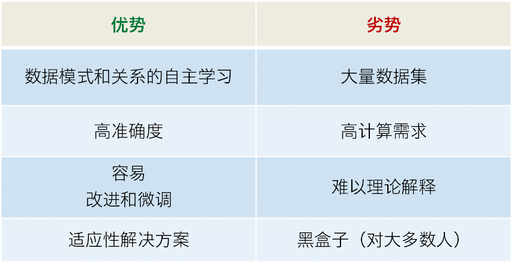
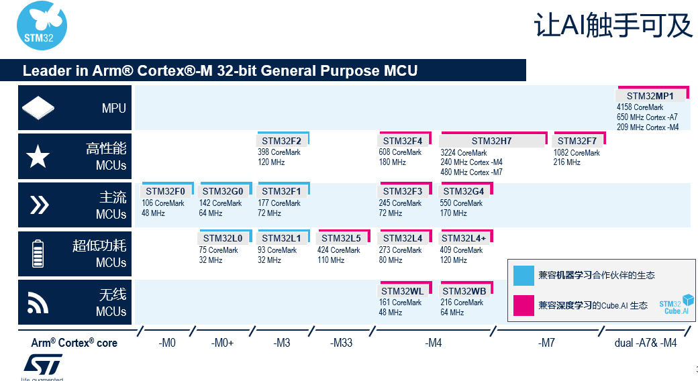

# 声纹识别单元设计-硬件方案篇

本项目部署的平台是STM32和FPGA。下面分别就这两个硬件平台来设定相关方案。这两个平台最大的优点就是低功耗和便携。本课题要将这两个优点再进一步强化，对于处理能力、内存和功率受到限制的便携式或可穿戴设备。通过在高性价比、超低功耗STM32微控制器和K210上利用人工智能解决成本与设计问题。

## 一、STM32系列选型

### 1.内核概况

STM32是基于ARM内核的32位MCU系列，它的内核是Cortex-M内核，是标准的ARM架构。不过在19年时意法半导体推出了第一颗通用型STM32 MPU，内核从Cortex-M跨到了Cortex-A，软件上兼顾了运行在A7核上的Linux 与跑在M4内核的 STM32Cube。

ARM Cortex内核系列提供非常广泛的具有可扩展性的性能选项，设计人员有机会在多种选项中选择最适合自身应用的内核，而非千篇一律的采用同一方案。Cortex系列组合大体上分为三种类别：

- Cortex-A：面向性能密集型系统的应用处理器内核，对成本敏感型的智能手机和平板电脑来说是理想的选择。
- Cortex-R：面向实时应用的高性能内核，针对高性能实时应用而设计。例如硬盘控制器、企业中的网络设备和打印机、消费电子设备以及汽车应用(安全气囊、制动系统和发动机管理)
- Cortex-M：面向各类嵌入式应用的微控制器内核。

根据需求，我们不需要过强的Cortex-A，Cortex-M足矣。

## 2.M系列横向对比与选型

Arm Cortex-M系列处理器内核是专为高能效和确定性操作而优化的一系列核心。它广泛用于微控制器(MCU)并且也可以嵌入到多核微处理器(MPU)中。从最初的[Cortex®-M3](https://www.st.com/content/st_com/zh/arm-32-bit-microcontrollers/arm-cortex-m3.html?icmp=tt18583_gl_lnkon_nov2020)微处理器内核和引入专为**低功率**(如[Cortex®-M0](https://www.st.com/content/st_com/zh/arm-32-bit-microcontrollers/arm-cortex-m0.html?icmp=tt18583_gl_lnkon_nov2020)以及随后的[Cortex®-M0+](https://www.st.com/content/st_com/zh/arm-32-bit-microcontrollers/arm-cortex-m0-plus.html?icmp=tt18583_gl_lnkon_nov2020))、**性能(**采用[Cortex®-M7](https://www.st.com/content/st_com/zh/arm-32-bit-microcontrollers/arm-cortex-m7.html?icmp=tt18583_gl_lnkon_nov2020))、**实时性(**采用[Cortex®-M4](https://www.st.com/content/st_com/zh/arm-32-bit-microcontrollers/arm-cortex-m4.html?icmp=tt18583_gl_lnkon_nov2020))或**安全性**(采用最新的[Cortex®-M33](https://www.st.com/content/st_com/zh/arm-32-bit-microcontrollers/arm-cortex-m33.html?icmp=tt18583_gl_lnkon_nov2020))优化的内核变体，Arm Cortex-M架构成为了32位通用MCU的实际标准架构。它也为通用8位和16位MCU架构提供了有竞争力的替代选择。图源([https://www.eet-china.com/mp/a54021.html](https://www.eet-china.com/mp/a54021.html))

由图中信息可知：

- Cortex-M0、Cortex-M0+、Cortex-M1系列内核使用Armv6-M架构。
    
    Cortex M0处理器是ARM最小的处理器之一，主要特点是小体积，目的是使开发人员能够在8位的价格实现 32 位的性能。Cortex M0+处理器在Cortex M0处理器的基础上，进一步降低了功耗，提升了性能。Cortex M1是首个专为FPGA的实现而设计的处理器。
    
- **常用的Cortex-M3、Cortex M4、Cortex M7系列内核使用Armv7-M架构**
    
    Cortex-M3处理器是专为高性能、低成本平台开发设计的，包括汽车车身系统、工业控制系统、无线网络、传感器等。Cortex-M4处理器是一款高效的嵌入式处理器，使用3个AMBA AHB-Lite 总线，三级流水线，支持Thumb/Thumb-2部分指令集，支持8 to 256优先级等级。相比Cortex-M3，Cortex-M4**增加了 DSP 扩展和可选的单精度浮点单元。**Cortex M7处理器是一款高性能、节能的处理器，**6 级大规模流水线**，支持Thumb/Thumb-2指令集，支持8 to 256优先级等级，支持DSP扩展、可选的单精度浮点单元，使用1个64-bit AMBA4 AXI总线，1个32-bit AHB外设接口、1个为外部主机访问TCMs内存提供的32-bit AMBA AHB从机接口，**拥有指令cache、数据cache、指令TCM、数据 TCM**。
    
- Cortex-M23系列使用Armv8-M Baseline架构，Cortex-M33、Cortex-M33P、Cortex-M55 系列使用Armv8-M Mainline架构。
    
    Cortex M23处理器是一款非常简洁的处理器，对于大多数需要安全性的IoT和嵌入式应用，带有TrustZone的Cortex-M23是一个理想的处理器。Cortex-M33适用于需要有效安全性或者数字信号控制的嵌入式和IoT应用场景。Cortex-M33有非常多的可选特性，包括DSP 扩展、用于硬件强制隔离的TrustZone安全特性、一个协处理器接口、内存保护单元和浮点计算单元。后续的不再过多赘述
    

这些Cortex-M内核对应的芯片型号如下图所示，其中Cortex-M4和Cortex-M33都能满足我们的需求。图源([https://www.stmcu.com.cn/ecosystem/app/ai](https://www.stmcu.com.cn/ecosystem/app/ai))

### 3.根据需求最终确定型号

机器学习是AI的分支，在计算机科学领域的应用使计算机无需显式编程就能学习。机器学习由能够基于数据进行学习和预测的算法组成：

- 这类算法在前面样本基础上进行训练，以构建和估计模型;
- 在传统编程不可行的情况下，通常采用机器学习;
- 如果经过适当的训练，可以适应新的案例应用。

机器学习有不同的实现方法，其中包括常见的：

- 决策树
- 聚类
- 基于规则的学习
- 归纳逻辑编程
- 深度学习

深度学习是利用神经网络进行的学习：

- 灵感来自生物神经网络
- 深度是指有很多中间的学习步骤
- 需要大量数据

其中深度学习有如下的优势和劣势：

意法半导体关于AI的相关生态如下图所示：

由于声音处理不需要过高的数字信号计算，所以我们主要是根据深度学习资源来选择最终型号。根据低功耗原则，最后选择STM32L4+。

## 二、STM32系列音频采集方案

由《声纹识别单元设计-开题原理篇》可知，音频信号从输入到处理有以下的步骤，但依然很空泛，所以需要补上更多的和硬件实际结合的细节。

当我们说话时，人声会产生沿空气传播的压力波。如果录音设备(如麦克风)的振膜在附近，空气波会在振膜中产生振动。由振膜本身产生的信号往往都会强度不足，我们就需要使用前置放大器来增强信号，以便可以通过各种方式来记录信号。曾经人们采用磁带等物理介质来记录信号，现在更多都是采用数字方式记录和存储模拟波，这就是**PCM**(脉冲编码调制)。在PCM流中，会用均匀的时间间隔对音频振幅进行采样。 

根据设计需要，麦克风有数字和模拟两种，它们对音频的处理也不尽相同。

### 1.元件级模/数MEMS**麦克风及接口协议**

MEMS麦克风输出并不是直接来自MEMS换能单元。换能器实质上是一个可变电容，并且具有特别高的兆欧级输出阻抗。在麦克风封装中，换能器信号先被送往前置放大器，而这个放大器的首要功能是阻抗变换，当麦克风接进音频信号链时将输出阻抗降低到更合适的值。麦克风的输出电路也是在这个前置放大电路中实现的。

对于模拟MEMS麦克风来说，内部集成的电路基本上是一个具有特殊输出阻抗的放大器。在数字MEMS麦克风中，这个放大器与模数转换器(ADC)集成在一起，以**脉冲密度调制(PDM)或I2S格式**提供数字输出，从而实现了从麦克风到处理器的全数字音频捕获通道。

PDM和PCM都是一种调制形式，用于表示数字域中的模拟信号。PDM是1位数字采样的高频数据流。在PDM信号中，脉冲的相对密度对应于模拟信号的幅度，大量的1s对应于高(正)幅度值，而大量的0s对应于低(负)幅度值，交替的1s和0s对应于幅度值0。PDM信号无法直接驱动DA进行声音播放，它要变为声音信号还需要进行下采样，经过一次低通滤波和抽样，然后成为PCM信号。大多数现代的数字音频系统使用PCM以表征信号，使得信号处理的操作可以在音频流上完成，例如混合，滤波和均衡。而PDM只用1bit来传输音频，在概念上和可实行度上比PCM更简单。它正被普遍用在手机内将音频从麦克风传输给信号处理器。PDM在理论上很适合这个任务，因为它带来了数字的好处，例如低噪声和免于干扰信号，且成本较低。

I2S一直是音频转换器和处理器的一种通用数字接口，只是最近才被集成进信号链边缘的设备中，比如麦克风。I2S麦克风拥有与PDM麦克风相同的系统设计优势，但不再输出高采样速率的PDM信号，它输出的数字数据采用抽取过的基带音频采样率。在PDM麦克风方案中，这种抽取是在编解码器或DSP中实现的，但在I2S麦克风方案中，这个抽取过程直接在麦克风中完成，因此在某些系统中可以完全取消ADC或编解码器。

数字MEMS麦克风经常在模拟音频信号容易受到干扰的应用中使用。例如在平板电脑中，麦克风的位置也许不靠近ADC，这两点之间的信号可能会穿越或接近Wi-Fi、蓝牙或蜂窝天线。将这些连接数字化后，它们就不容易受到这些射频干扰而在音频信号中产生噪声或失真。这种拾取有害系统噪声的改进给设计中的麦克风布局提供了很大的灵活性。由于应用场景以及简化设计的需要，本课题选择数字麦克风。可选的有I2S和PDM两种。

待续～

## 三、FPGA

官方指定了型号：**Sipeed Maix Dock K210开发板**

资源和外设很充足，关于音频采集有更多的选项。